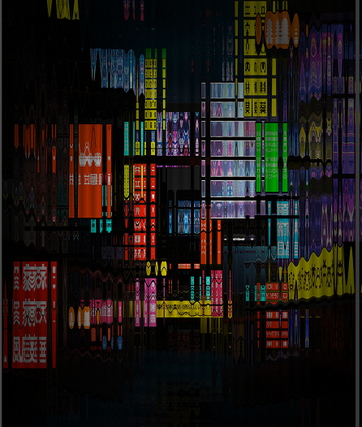
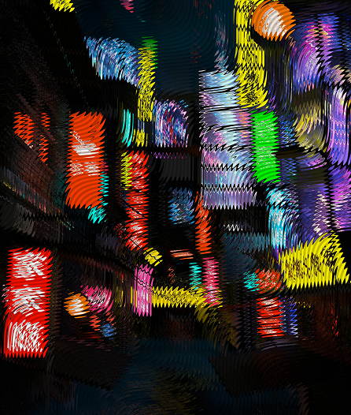

# CLAUDE.md

This file provides guidance to Claude Code (claude.ai/code) when working with code in this repository.

## What this project is

Neuroshade is a static, vanilla HTML/CSS/JS image editing tool — no build step, no bundler, no framework. Open `index.html` directly in a browser to run it. The `@paper-design/shaders-react` package in `node_modules` is available but the main app does not currently use it.

## Running the app

No build step required. Open any HTML file directly in a browser, or use a static file server:

```bash
npx serve .         # serves on http://localhost:3000
# or
python -m http.server 8080
```

## File structure

- **`index.html`** — the full application (3269 lines, inline CSS + HTML + JS). See section map below.
- **`components/`** — reusable CSS-only component stylesheets, linked from `index.html`
  - `Button/Button.css` — `.btn`, `.btn-primary`, `.btn-secondary`, `.btn-tertiary`
  - `Slider/Slider.css` — `.slider-row`, `.slider-track`, `.track-fill`, `.slider-thumb`, `.value-display`
  - `Checkbox/Checkbox.css` — `.checkbox-row`, `.checkbox` (add class `checked` to check it)
  - `ColorSelector/ColorSelector.css` — `.color-selector`, `.color-swatch`, `.color-hex`
- **`icons/`** — SVG icons used by filter buttons (referenced via CSS mask)
- **`placeholders/`** — PNG thumbnails for filter buttons (base + hover variants)
- **`figma.json`** — maps Figma node IDs to component CSS files (file key: `vuz3bNrwb0IuzmzhgDuxk1`)

### Prototype/exploration files

These are standalone component sandboxes, not part of the main app:
- `filter-button.html` — filter button styles
- `glass-filter.html` — glass filter panel layout
- `angle-knob.html` — rotary knob widget
- `shape-selector.html` — dropdown shape selector
- `slider.html` — slider widget

## `index.html` section map

Use `offset` + `limit` when reading. The file is 3269 lines.

| Lines | Content |
|---|---|
| 1–13 | `<head>` — meta, Google Fonts, component CSS links |
| 14–781 | `<style>` — all inline CSS |
| 782 | External: `media-shader.js` from unpkg |
| 783–784 | `</head><body>` |
| 785–793 | `.app` / `.sidebar` shell open |
| 794–1016 | Filter button strip (`.filter-buttons`) |
| 804 | Glass button (default selected, `data-filter="glass"`) |
| 845 | Dithering button (`data-filter="dithering"`) |
| 892 | Halftone button (`data-filter="halftone"`) — no panel yet |
| 938 | Liquid button (`data-filter="liquid"`) |
| 976 | Granny button (`data-filter="granny"`) — no panel yet |
| 1018–1020 | `#panelWrapper` open |
| 1021–1093 | `#glassPanel` — shape selector + sliders + knob |
| 1094–1220 | `#ditheringPanel` — dither type, sliders, checkboxes, colors |
| 1221–1325 | `#liquidPanel` — sliders + colors + play/pause |
| 1326 | `#panelWrapper` close |
| 1327–1375 | `.action-bar` (Save / Upload new buttons) |
| 1376–1397 | `.preview-panel` + `.image-area` HTML |
| 1398–1482 | `<script>` open + `ShapeSelector` custom element |
| 1483–1569 | Vertex shader GLSL |
| 1570–1809 | `flutedGlassFragmentShader` GLSL |
| 1810–1812 | `GlassGridShapes` enum |
| 1813–1890 | `waterFragmentShader` GLSL (liquid filter) |
| 1891–2005 | `imageDitheringFragmentShader` GLSL + `DitheringTypes` enum |
| 2006–2267 | `ShaderMount` custom element class |
| 2268–2281 | **Global state variables** (see below) |
| 2285–2341 | `hexToVec4`, `getDitherUniforms`, `updateDitherShader`, `initDitherShader` |
| 2342–2412 | `updateShader` (glass), `getLiquidUniforms`, `updateLiquidShader`, `initLiquidShader` |
| 2413–2465 | `switchPanel` + filter tab wiring + wheel scroll on strip |
| 2466–2479 | Filter button click handlers |
| 2480–2556 | Dither-type buttons, checkboxes, color selectors |
| 2557–2574 | Liquid play/pause + shape selector wiring |
| 2575–2802 | `makeSlider` factory + all slider instances |
| 2803–2943 | Angle knob (drag, inertia, tick marks) |
| 2944–3017 | `initShader`, `makeFallbackImage`, `tryInitWithImage` |
| 3018–3062 | Fit/Fill control |
| 3063–3099 | Upload button + drag-and-drop |
| 3100–3171 | `renderToBlob` (PNG export) + copy-to-clipboard (Cmd+C) |
| 3172–3220 | Fill-mode image drag (pan) |
| 3221–3269 | Grain overlay shader + `</script></body></html>` |

## JS state variables (line 2268)

```js
let shaderMount   // active ShaderMount instance (null until image loaded)
let shaderSize    // glass: distortion size (default 10)
let shaderGrain   // glass: grain overlay amount (default 0)
let shaderShape   // glass: grid shape key (default 'lines') — see GlassGridShapes
let liqHighlights, liqWaves, liqCaustic, liqSize, liqLayering  // liquid params (all default 50)
let shaderFit     // 2 = fill, 1 = fit
let imgOffsetX, imgOffsetY  // fill-mode pan offset (normalized)
let imgAspect     // uploaded image aspect ratio (default 1)
let activeFilter  // 'glass' | 'dithering' | 'liquid' (default 'glass')
let liquidPlaying // animation running (default true)
let angle         // knob angle in degrees (default 0)
```

## Key element IDs

| ID | Purpose |
|---|---|
| `panelWrapper` | Container that swaps between filter panels |
| `glassPanel` / `ditheringPanel` / `liquidPanel` | Individual control panels |
| `knob` / `indicator` / `knobDisplay` | Angle knob widget |
| `fitControl` | Fit/Fill toggle bar |
| `shaderImage` | Hidden `` holding the uploaded image |
| `ditherSizeDisplay` / `ditherStepsDisplay` | Dithering slider value inputs |
| `originalColorsCheck` / `invertCheck` | Dithering checkboxes |
| `bgHex` / `fgHex` / `hlHex` | Dithering color inputs |
| `liqFrontHex` / `liqHlHex` | Liquid color inputs |
| `liqPlayPauseBtn` | Liquid animation play/pause button |

## Panel switch mechanism

`switchPanel(filter)` at line 2416. It:
1. Fades out the current panel (`#activeFilterPanel`) via opacity
2. Fades in `#filterPanel` (e.g. `#glassPanel`)
3. Updates `activeFilter`
4. Re-inits the shader for the new filter with the current image

Only `'glass'`, `'dithering'`, and `'liquid'` are in `PANEL_FILTERS` (line 2414). Halftone and Granny buttons exist in the strip but have no panels yet.

## Architecture: `index.html`

The app is a two-column layout: a **600px fixed sidebar** (controls) on the left and a **flex-fill preview panel** on the right.

All CSS, HTML, and JavaScript live in `index.html`. The component CSS files are linked in `<head>` and extend the inline styles.

Key JS responsibilities in `index.html`:
- Image upload via `<input type="file">` and drag-and-drop onto the preview panel
- Fit/Fill toggle for the uploaded image
- Filter button selection (clicking a `.filter-btn` activates a controls panel swap)
- Slider drag interaction (mousedown on `.slider-track` → mousemove to scrub)
- Angle knob drag (circular drag gesture → degrees)
- PNG export via off-screen canvas (`renderToBlob` at line 3101)

## Design tokens

| Token | Value | Usage |
|---|---|---|
| Accent | `#fff679` | Selected state, primary button, active slider fill |
| Background | `#0e0e0e` | Body |
| Panel dark | `#141414` | Input fields, dropdown |
| Panel mid | `#1a1a1a` / `#202020` | Controls panel, image area |
| Panel light | `#373737` / `#434343` | Sidebar, filter buttons |
| Text primary | `#d6d6d6` | Labels |
| Text secondary | `#c7c7c7` | Button text, icon color |
| Font | `'Geist'` → `'Inter'` → `system-ui` | All text, 16px/400 base |

Accent glow: `rgba(255, 246, 121, 0.6)` drop-shadow, `rgba(255, 246, 121, 0.5)` text-shadow.

## Icon pattern

Icons use CSS masking, not ``:

```html
<div class="filter-icon" style="--icon: url('icons/blur.svg')"></div>
```

```css
.filter-icon {
  background: #c7c7c7;          /* icon color */
  mask: var(--icon) no-repeat center / contain;
  -webkit-mask: var(--icon) no-repeat center / contain;
}
```

Change icon color by changing `background` (not `color`).

## Filter button thumbnails

Each filter button has a base thumbnail and a hover thumbnail that crossfades in:

```html
<div class="btn-thumbnail">
  
  
</div>
```

`thumb-hover` has `opacity: 0` by default and transitions to `opacity: 1` on hover/selected via CSS.
